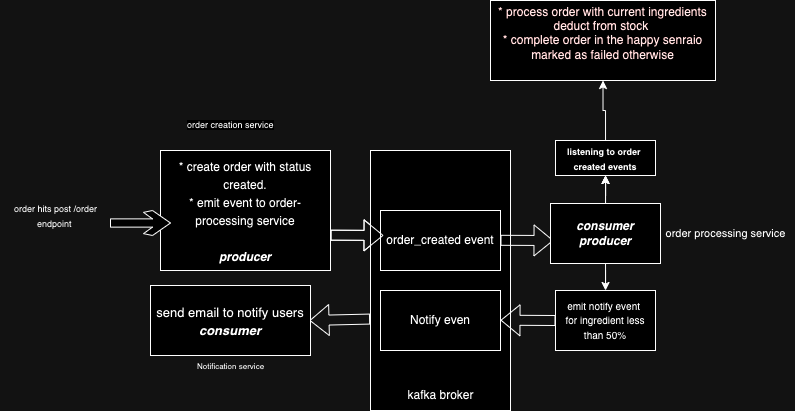

# NestJS Microservices Project

## Overview

This project implements a monorepo microservice-based architecture for processing orders, updating ingredient stock levels, and sending notifications when stock falls below a threshold. The services communicate asynchronously using **Kafka**, enabling real-time event-driven workflows.

The system consists of three primary services:

1. **Order Creation Service**: Handles order creation and emits an `OrderCreated` event.
2. **Order Processing Service**: Listens for `OrderCreated` events, updates ingredient stock, and emits a low-stock alert if stock falls below 50%.
3. **Notification Service**: Listens for low-stock alerts and sends email notifications to relevant personnel.

## Architecture

### Services

1. **Order Service** (Producer)

   - **Purpose**: Handles incoming requests for order creation.
   - **Process**:
     - Receives an order request .
     - Validates and saves the order to the database.
     - Emits an `OrderCreated` event to Kafka on the `order_created` topic.

2. **Order Processing Service** (Consumer & Producer)

   - **Purpose**: Listens for `OrderCreated` events, processes the order, updates stock levels, and checks for low stock.
   - **Process**:
     - Consumes `OrderCreated` events from Kafka.
     - Updates stock levels based on ingredients used in the order.
     - If any ingredient's stock falls below 50%, emits an `Notify` event.

3. **Notification Service** (Consumer)

   - **Purpose**: Listens for `Notify` events and sends email alerts when stock is critically low.
   - **Process**:
     - Consumes `Notify` events from the `notify` topic.
     - Sends email notifications to alert staff that stock is running low.

### Why Kafka ?

1. **Asynchronous Communication**: Kafka allows services to process tasks asynchronously. For example, once an order is created, the **Order Creation Service** immediately responds to the client, while the actual order processing (such as stock updates) is handled in the background by other services.
2. **Scalability**: Kafka's ability to handle high-throughput messaging ensures that services can scale independently. If there is an increase in orders, only the **Order Creation Service** needs to scale, without affecting other parts of the system.
3. **Fault Tolerance**: Kafka persists messages in topics, allowing services to recover from failures without losing important events. For example, if the **Order Processing Service** is down, Kafka retains the `OrderCreated` event until it can be processed when the service is back online.
4. **Loose Coupling**: Kafka decouples services, making it possible for them to function independently. For instance, the **Notification Service** doesn't need to know about the **Order Processing Service**—it just listens for the `Notify` event from Kafka.

---

## why NestJS ?

1. **Event-driven Nature**: Node.js is well-suited for event-driven architectures like Kafka-based microservices, as it can handle asynchronous I/O efficiently, making it ideal for processing a high volume of Kafka events.
2. **NestJS Microservice Support**: NestJS has built-in support for Kafka, making it easy to build producers and consumers with minimal configuration. This allows for clean, structured microservice code.
3. **Modularity**: NestJS’s modular architecture enables clear separation of concerns. Each service (Order, Processing, Notification) is developed as an independent microservice , improving code maintainability and scalability and it offers a common lib approach to shared code between services.

### Test Cases

### Order Creation Test

A test case was written for the **Order Service** to verify that:

- An order can be successfully created when provided with valid input.
- An `OrderCreated` event is emitted to Kafka once the order is created.

### Order Processing Test

A test case was written for the **Order Processing Service** to verify that:

- The service correctly consumes the `OrderCreated` event.
- Ingredient stock is properly updated based on the order details.
- An `Notify` event is emitted to Kafka if any ingredient stock falls below 50%.

Technology Stack

- **NestJS**
- **TypeORM**
- **Postgres**
- **Kafka**
- **Docker Compose**
- **TypeScript**
- **Nodemailer**

## Build and Start Services

Use Docker Compose to build and start all services and required env as .env.example:
I used pnpm in this project as package manager , to install it > `npm i -g pnpm`

#### Code

## To build and start the app

`pnpm i && docker-compose up --build // to build and start the apps`

## To run the tests

`pnpm i && pnpm run test // to run testcases `

**Room to improvments**: I built this project to be open to any change and to be a foundation for a fault Tolerance scalable system.

- using partition and more than broker for kafka for large scalse.
- add merchant entity.
- add payments cycle.
- parition postgres based on marchant Id.

# API Endpoints

## Orders

| **HTTP Method** | **Endpoint**  | **Description**              | **Request Parameters**  | **Response**             |
| --------------- | ------------- | ---------------------------- | ----------------------- | ------------------------ |
| `POST`          | `/order`      | Create a new order           | `CreateOrderDto` (body) | `Order` object (created) |
| `POST`          | `/order/seed` | to seed products for testing |                         |                          |

# Kafka Events

## Order Created Event

| **Event Name**  | **Description**                     | **Payload**        |
| --------------- | ----------------------------------- | ------------------ |
| `ORDER_CREATED` | Emitted when a new order is created | `{ "id": number }` |

## Ingredient Low Stock Alert

| **Event Name** | **Description**                                                                             | **Payload**                       |
| -------------- | ------------------------------------------------------------------------------------------- | --------------------------------- |
| `NOTIFY`       | Emitted when an ingredient's stock falls below a threshold with ingredientId and user email | `{ "id": number, email: string }` |
